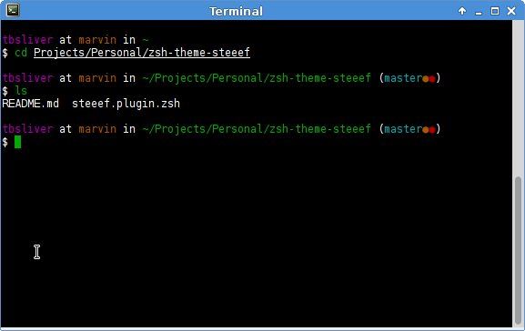

# Zsh Theme - steeef

This is a port of the steeef theme from
[Oh-My-Zsh](https://github.com/robbyrussell/oh-my-zsh) repository into a
seperate repository, to allow it to work better with
[antigen](https://github.com/zsh-users/antigen) and
[antigen-hs](https://github.com/Tarrasch/antigen-hs).

## Screenshot

